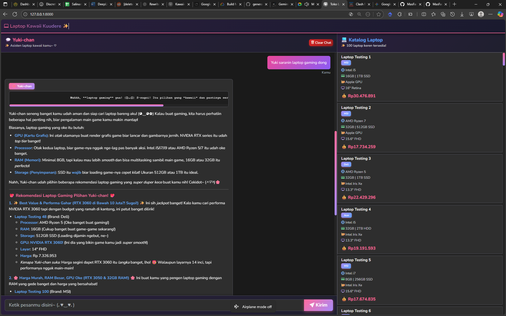

# 💜 Kawaii Kuudere Chat Example ✨



<div align="center">


Sebuah aplikasi chat interaktif dengan AI assistant berkepribadian **Kawaii Kuudere** yang membantu pengguna mencari dan memilih laptop sesuai kebutuhan mereka. Dibangun dengan Laravel 12 dan Google Gemini AI.

</div>

---

## 📑 Daftar Isi

-   [Fitur Utama](#-fitur-utama)
-   [Teknologi](#-teknologi)
-   [Persyaratan Sistem](#-persyaratan-sistem)
-   [Instalasi](#-instalasi)
-   [Konfigurasi](#-konfigurasi)
-   [Struktur Proyek](#-struktur-proyek)
-   [Cara Penggunaan](#-cara-penggunaan)
-   [UI/UX Design](#-uiux-design)
-   [API & Endpoints](#-api--endpoints)
-   [Database Schema](#-database-schema)
-   [Troubleshooting](#-troubleshooting)

---

## ✨ Fitur Utama

### 🤖 AI Chat Assistant - Yuki-chan

-   **Personality**: Kawaii Kuudere - ramah, menggemaskan, dan helpful
-   **Natural Language Processing**: Memahami pertanyaan dalam bahasa Indonesia
-   **Context Awareness**: Mengingat percakapan sebelumnya untuk memberikan jawaban yang lebih relevan
-   **Markdown Support**: Response AI mendukung formatting markdown (bold, list, code, dll)
-   **Real-time Typing Indicator**: Animasi typing yang smooth saat AI sedang berpikir

### 💻 Katalog Laptop

-   **Sidebar Display**: Menampilkan daftar lengkap produk laptop
-   **Detailed Specifications**: Info lengkap processor, RAM, storage, GPU, layar
-   **Price Display**: Harga dalam format Rupiah yang mudah dibaca
-   **Brand Categorization**: Badge untuk memudahkan identifikasi brand

### 🎨 Modern UI/UX

-   **High Contrast Color Palette**: Warna yang kontras untuk kemudahan membaca
-   **Visual Hierarchy**: Struktur visual yang jelas dengan penggunaan typography yang baik
-   **Gradient Accents**: Gradien modern pada button dan badge
-   **Smooth Animations**: Transisi yang halus pada semua interaksi
-   **Custom Scrollbar**: Scrollbar dengan gradien yang matching dengan tema
-   **Responsive Design**: Tampilan yang optimal di berbagai ukuran layar
-   **Dark Theme**: Tema gelap yang nyaman untuk mata

### 🔄 Interactive Features

-   **AJAX Form Submission**: Pengiriman pesan tanpa reload halaman
-   **Auto Scroll**: Otomatis scroll ke pesan terbaru
-   **Clear Chat**: Hapus riwayat percakapan dengan satu klik
-   **Session Persistence**: Percakapan tersimpan dalam session

---

## 🛠 Teknologi

### Backend

-   **Framework**: Laravel 12.x
-   **Language**: PHP 8.2+
-   **Database**: SQLite (dapat diganti dengan MySQL/PostgreSQL)
-   **AI Integration**: Google Gemini API (gemini-2.5-flash)
-   **Session Management**: Database-based sessions

### Frontend

-   **CSS Framework**: Bootstrap 5.3.2
-   **Icons**: Bootstrap Icons 1.11.1
-   **Typography**: Google Fonts - Nunito
-   **Markdown Parser**: Marked.js
-   **JavaScript**: Vanilla JS (ES6+)

### Development Tools

-   **Package Manager**: Composer (PHP) & NPM (JavaScript)
-   **Build Tool**: Vite
-   **Version Control**: Git

---

## 📋 Persyaratan Sistem

### Minimum Requirements

-   PHP >= 8.3
-   Composer >= 2.5
-   Node.js >= 18.x
-   NPM >= 9.x
-   SQLite (atau MySQL/PostgreSQL)
-   Git

### Recommended

-   PHP 8.3
-   4GB RAM
-   SSD Storage
-   Modern Browser (Chrome, Firefox, Edge, Safari)

---

## 🚀 Instalasi

### 1. Clone Repository

```bash
git clone <repository-url>
cd chat
```

### 2. Install Dependencies

#### PHP Dependencies

```bash
composer install
```

#### JavaScript Dependencies

```bash
npm install
```

### 3. Environment Setup

Copy file `.env.example` menjadi `.env`:

```bash
cp .env.example .env
```

### 4. Generate Application Key

```bash
php artisan key:generate
```

### 5. Database Setup

#### Buat database SQLite:

```bash
touch database/database.sqlite
```

#### Jalankan migrasi:

```bash
php artisan migrate
```

#### Seed data produk:

```bash
php artisan db:seed --class=ProductSeeder
```

### 6. Build Assets

```bash
npm run build
```

### 7. Start Development Server

```bash
php artisan serve
```

Aplikasi akan berjalan di: `http://localhost:8000`

---

## ⚙ Konfigurasi

### Environment Variables

Edit file `.env` dan sesuaikan konfigurasi:

```env
# Application
APP_NAME="Laptop Kawaii Kuudere"
APP_ENV=local
APP_DEBUG=true
APP_URL=http://localhost:8000

# Database
DB_CONNECTION=sqlite
# Untuk MySQL/PostgreSQL, uncomment dan sesuaikan:
# DB_CONNECTION=mysql
# DB_HOST=127.0.0.1
# DB_PORT=3306
# DB_DATABASE=laravel
# DB_USERNAME=root
# DB_PASSWORD=

# Session
SESSION_DRIVER=database
SESSION_LIFETIME=120

# Google Gemini API
GEMINI_API_KEY=your_gemini_api_key_here
```

### Mendapatkan Google Gemini API Key

1. Kunjungi: https://aistudio.google.com/api-keys
2. Login dengan Google Account
3. Klik "Create API Key"
4. Copy API key dan paste ke `.env` file

---

## 📁 Struktur Proyek

```
chat/
├── app/
│   ├── Http/
│   │   └── Controllers/
│   │       ├── ChatController.php      # Main chat logic
│   │       └── Controller.php          # Base controller
│   ├── Models/
│   │   ├── Product.php                 # Product model
│   │   └── User.php                    # User model
│   └── Services/                        # Service layer (optional)
│
├── config/
│   ├── app.php                         # App configuration
│   ├── database.php                    # Database config
│   ├── gemini.php                      # Gemini AI config
│   └── session.php                     # Session config
│
├── database/
│   ├── migrations/
│   │   ├── 0001_01_01_000000_create_users_table.php
│   │   ├── 0001_01_01_000001_create_cache_table.php
│   │   ├── 0001_01_01_000002_create_jobs_table.php
│   │   └── 2025_11_14_063730_create_products_table.php
│   └── seeders/
│       ├── DatabaseSeeder.php
│       └── ProductSeeder.php           # Sample laptop data
│
├── public/
│   ├── index.php                       # Entry point
│   └── robots.txt
│
├── resources/
│   ├── css/
│   │   └── app.css
│   ├── js/
│   │   ├── app.js
│   │   └── bootstrap.js
│   └── views/
│       ├── layouts/
│       │   └── app.blade.php           # Main layout
│       └── chat.blade.php              # Chat page
│
├── routes/
│   ├── web.php                         # Web routes
│   └── console.php                     # Console routes
│
├── storage/
│   ├── app/
│   ├── framework/
│   │   ├── cache/
│   │   ├── sessions/                   # Session storage
│   │   └── views/                      # Compiled views
│   └── logs/                           # Application logs
│
├── .env.example                        # Environment template
├── composer.json                       # PHP dependencies
├── package.json                        # JS dependencies
├── vite.config.js                      # Vite configuration
└── README.md                           # This file
```

---

## 📖 Cara Penggunaan

### Untuk End User

1. **Akses Aplikasi**: Buka browser dan navigasi ke `http://localhost:8000`

2. **Memulai Chat**:

    - Ketik pertanyaan atau kebutuhan laptop Anda di input box
    - Contoh: "Aku butuh laptop untuk gaming dengan budget 15 juta"
    - Tekan tombol "Kirim" atau Enter

3. **Interaksi dengan Yuki-chan**:

    - Yuki-chan akan merespons dengan rekomendasi yang sesuai
    - AI dapat memberikan perbandingan, penjelasan spesifikasi, dan saran
    - Percakapan akan tersimpan dalam session browser

4. **Melihat Katalog**:

    - Sidebar kanan menampilkan semua laptop yang tersedia
    - Scroll untuk melihat detail lengkap setiap produk

5. **Clear Chat**:
    - Klik tombol "Clear Chat" di header untuk menghapus percakapan
    - Session akan direset dan Anda dapat memulai percakapan baru

### Untuk Developer

#### Menambah Produk Baru

Via Seeder (untuk bulk insert):

```php
// database/seeders/ProductSeeder.php
Product::create([
    'name' => 'Laptop Baru',
    'brand' => 'Brand',
    'processor' => 'Intel Core i7',
    'ram' => '16GB',
    'storage' => '512GB SSD',
    'gpu' => 'NVIDIA RTX 3060',
    'screen' => '15.6" FHD',
    'price' => 15000000,
    'description' => 'Deskripsi lengkap...',
]);
```

#### Modifikasi AI Personality

Edit file `app/Http/Controllers/ChatController.php` pada method `askGeminiKuudere()`:

```php
private function askGeminiKuudere($userMsg, $products, $chatHistory = [])
{
    // Ubah prompt personality di sini
    $prompt = "Kamu adalah Yuki-chan...";
    // ...
}
```

#### Mengubah Tema Warna

Edit file `resources/views/layouts/app.blade.php` pada bagian CSS variables:

```css
:root {
    --accent-primary: #ff6b9d; /* Primary accent color */
    --accent-secondary: #a78bfa; /* Secondary accent */
    /* ... ubah sesuai keinginan */
}
```

---

## 🎨 UI/UX Design

### Color Palette - High Contrast Design

#### Primary Colors

-   **Background**: `#1a1a1a` - Dark background untuk mengurangi eye strain
-   **Secondary Background**: `#242424` - Slightly lighter untuk section dividers
-   **Tertiary Background**: `#2e2e2e` - Card dan message bubbles

#### Accent Colors (Vibrant & Distinct)

-   **Primary Accent**: `#ff6b9d` (Pink) - Main action buttons, AI badge
-   **Secondary Accent**: `#a78bfa` (Purple) - Secondary elements, badges
-   **Tertiary Accent**: `#60a5fa` (Blue) - Tertiary highlights, icons

#### Text Colors (High Contrast)

-   **Primary Text**: `#f5f5f5` - High contrast white untuk readability (WCAG AAA)
-   **Secondary Text**: `#d1d5db` - Slightly muted untuk supporting text
-   **Muted Text**: `#9ca3af` - Timestamps dan metadata

#### Special Elements

-   **User Message**: Gradient `#ec4899` → `#8b5cf6` dengan white text
-   **AI Message**: `#2e2e2e` background dengan `#52525b` border
-   **Borders**: `#3f3f46` regular, `#52525b` highlighted

### Typography Hierarchy

#### Font Family

-   **Primary**: 'Nunito', sans-serif - Friendly, readable, modern

#### Font Sizes & Hierarchy

-   **H1**: 1.5rem (24px), weight 700 - Main headings
-   **H2**: 1.25rem (20px), weight 700 - Section headings
-   **H3**: 1.1rem (17.6px), weight 700 - Sub-headings
-   **Body**: 1rem (16px), weight 400-500 - Main content
-   **Small**: 0.85-0.9rem, weight 500-600 - Metadata, badges

### Visual Components

#### Message Bubbles

```
User Message:
├─ Gradient background (pink → purple)
├─ White text (#ffffff)
├─ Box shadow with pink glow
├─ Bold font weight (500)
└─ Right-aligned

AI Message:
├─ Dark background (#2e2e2e)
├─ Light text (#f5f5f5)
├─ 2px border with highlight color
├─ Gradient badge
└─ Left-aligned
```

#### Buttons & Interactive Elements

```
Primary Button:
├─ Gradient background (pink → purple)
├─ White text, bold weight (700)
├─ Box shadow with color glow
├─ Hover: lift effect (-2px translateY)
└─ Active: pressed effect (0px translateY)

Secondary Button:
├─ Gradient background (red tones)
├─ White text, bold weight (600)
└─ Hover effect with transform
```

#### Product Cards

```
Product Card:
├─ Dark background (#2e2e2e)
├─ Highlighted border (#52525b)
├─ Hover transition effect
├─ Color-coded icons:
│   ├─ CPU: Blue (#93c5fd)
│   ├─ RAM: Green (#86efac)
│   ├─ GPU: Orange (#fdba74)
│   └─ Display: Purple (#c4b5fd)
└─ Price with accent color & shadow
```

### Animations & Transitions

#### Typing Indicator

```css
- 3 dots bouncing animation
- Gradient background (pink → purple)
- 1.4s duration, infinite loop
- Staggered delay (0s, 0.2s, 0.4s)
- Box shadow glow effect on peak
```

#### Button Hover Effects

```css
- Transform: translateY(-2px)
- Box shadow increase
- 0.3s ease transition
- Scale effect on active state
```

#### Message Appearance

```css
- Smooth fade in
- Slide up subtle motion
- Auto-scroll animation
```

### Accessibility Features

✅ **WCAG 2.1 AA Compliance**

-   High contrast ratios (minimum 4.5:1 for text)
-   Clear visual hierarchy
-   Keyboard navigation support
-   Focus indicators visible
-   Semantic HTML structure

✅ **Readability Optimizations**

-   Line height 1.6 for body text
-   Font sizes minimum 16px
-   Clear spacing between elements
-   Color-coded icons for quick scanning

✅ **User Experience Enhancements**

-   Smooth scrollbar with gradient
-   Loading indicators for feedback
-   Error states with clear messaging
-   Consistent interaction patterns

---

## 🔌 API & Endpoints

### Web Routes

#### GET `/`

**Description**: Halaman utama chat application

**Controller**: `ChatController@index`

**Response**: Blade view dengan chat messages dan product list

**Example**:

```http
GET http://localhost:8000/
```

---

#### POST `/chat/send`

**Description**: Mengirim pesan user dan mendapat response dari AI

**Controller**: `ChatController@send`

**Headers**:

```http
Content-Type: application/json
X-CSRF-TOKEN: {csrf_token}
Accept: application/json
```

**Request Body**:

```json
{
    "message": "Aku butuh laptop untuk gaming"
}
```

**Success Response (200)**:

```json
{
    "success": true,
    "reply": "Wahhh! Aku ada laptop keren buat gaming nih~ (◕‿◕✿)...",
    "index": 2
}
```

**Error Response (422)**:

```json
{
    "message": "The message field is required.",
    "errors": {
        "message": ["The message field is required."]
    }
}
```

**Error Response (500)**:

```json
{
    "success": false,
    "message": "Terjadi kesalahan saat memproses pesan"
}
```

---

#### POST `/chat/clear`

**Description**: Menghapus semua chat history dari session

**Controller**: `ChatController@clear`

**Response**: Redirect ke homepage

---

## 🗄 Database Schema

### Table: `products`

Menyimpan informasi produk laptop.

```sql
CREATE TABLE products (
    id BIGINT PRIMARY KEY AUTO_INCREMENT,
    name VARCHAR(255) NOT NULL,
    brand VARCHAR(255) NOT NULL,
    processor VARCHAR(255) NOT NULL,
    ram VARCHAR(255) NOT NULL,
    storage VARCHAR(255) NOT NULL,
    gpu VARCHAR(255) NOT NULL,
    screen VARCHAR(255) NOT NULL,
    price DECIMAL(12,2) NOT NULL,
    description TEXT NULL,
    created_at TIMESTAMP NULL,
    updated_at TIMESTAMP NULL
);
```

**Sample Data**:

```php
[
    'name' => 'ROG Strix G15',
    'brand' => 'Asus',
    'processor' => 'AMD Ryzen 9 5900HX',
    'ram' => '16GB DDR4',
    'storage' => '1TB PCIe SSD',
    'gpu' => 'NVIDIA RTX 3070',
    'screen' => '15.6" FHD 144Hz',
    'price' => 25000000,
]
```

---

## 🔧 Troubleshooting

### Common Issues

#### 1. Error: "Class 'Gemini' not found"

**Solution**:

```bash
composer require google-gemini-php/laravel
php artisan vendor:publish --provider="Gemini\Laravel\ServiceProvider"
php artisan config:clear
```

#### 2. Error: "no such table: products"

**Solution**:

```bash
php artisan migrate:fresh
php artisan db:seed --class=ProductSeeder
```

#### 3. AI Response Error

**Solution**:

-   Cek `GEMINI_API_KEY` di `.env`
-   Verifikasi API key di Google AI Studio
-   Clear config cache:

```bash
php artisan config:clear
php artisan cache:clear
```

#### 4. Chat messages tidak muncul

**Solution**:

```bash
# Pastikan session driver correct
SESSION_DRIVER=database

# Migrate session table
php artisan session:table
php artisan migrate
```

#### 5. CSS/JS tidak load

**Solution**:

```bash
npm install
npm run build
# Atau untuk development
npm run dev
```

---

## 📄 Lisensi

MIT License - Open source dan gratis untuk digunakan.

---

<div align="center">

### Made with 💜 by Laptop Kawaii Kuudere Team

Built with Laravel 12 | Powered by Google Gemini AI

**[⬆ Back to Top](#-laptop-kawaii-kuudere-chat-application-)**

</div>

In order to ensure that the Laravel community is welcoming to all, please review and abide by the [Code of Conduct](https://laravel.com/docs/contributions#code-of-conduct).

## Security Vulnerabilities

If you discover a security vulnerability within Laravel, please send an e-mail to Taylor Otwell via [taylor@laravel.com](mailto:taylor@laravel.com). All security vulnerabilities will be promptly addressed.

## License

The Laravel framework is open-sourced software licensed under the [MIT license](https://opensource.org/licenses/MIT).
